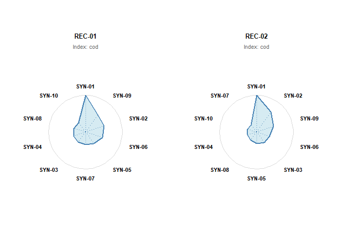
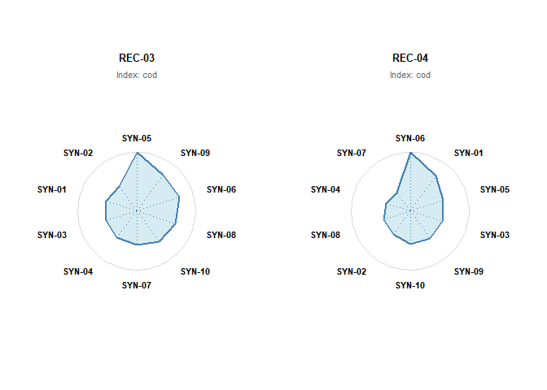
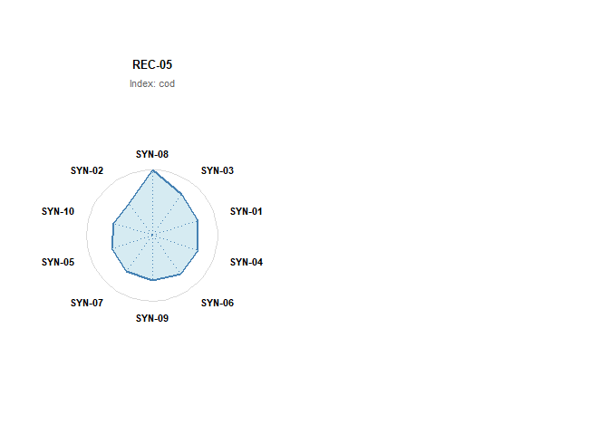
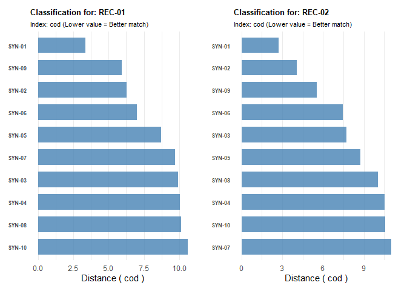
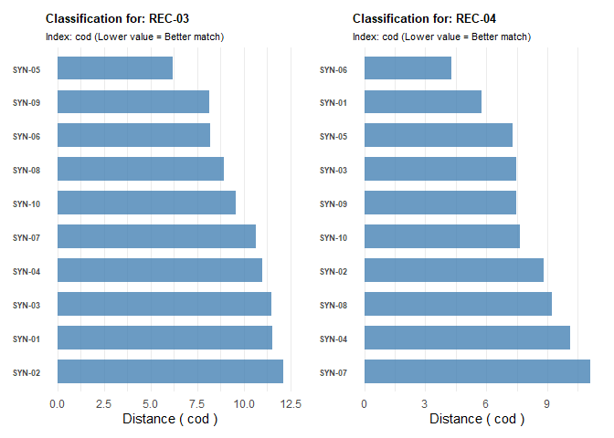
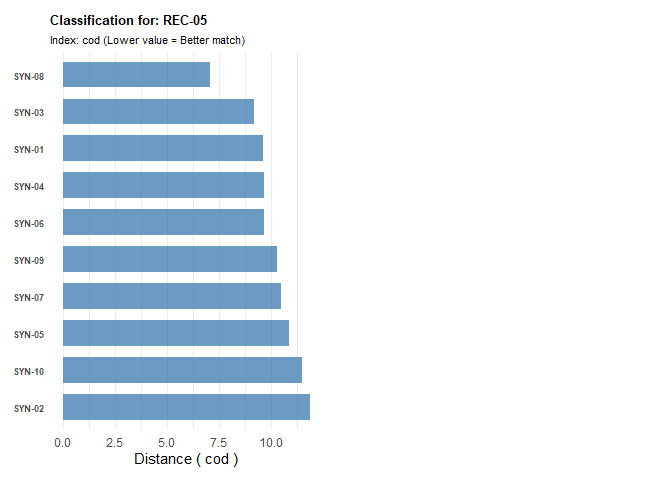

Inbovegtypering package
================

# Inbovegtypering package

<!-- badges: start -->

[](https://www.repostatus.org/#concept)
[](https://lifecycle.r-lib.org/articles/stages.html#experimental)
[](https://www.gnu.org/licenses/gpl-3.0.html)
[](https://github.com/inbo/inbovegtypering/releases)

[](https://github.com/inbo/inbovegtypering/actions)

 [](https://app.codecov.io/gh/inbo/inbovegtypering?branch=main)


The goal of inbovegtypering is to classify vegetation relevés (plots)
into predefined vegetation types (syntaxa) based on the methods
described by van Tongeren et al. (2008). It implements the ASSOCIA
algorithm for supervised clustering.

## Installation

You can install the development version of inbovegtypering from GitHub
with:

``` r
# install.packages("devtools")
devtools::install_github("inbo/inbovegtypering")
```

## Methodology

The core function classify_vegetation() calculates similarity indices
between your vegetation recordings and a reference synoptic table.

The indices include:

- **Composite Distance (CoD):** The primary classification metric
  combining qualitative and quantitative data.

- **(un)Likelihood (-2ln):** A qualitative distance measure based on
  species presence/absence.

- **Weirdness:** Measures the presence of unexpected species.

- **Incompleteness:** Measures the absence of expected species.

- **Modified Euclidean Distance (MED):** A quantitative distance measure
  based on species abundance (cover).

**Note:** For all these indices, a **lower value** indicates a
**better** match.

## Workflow

The classification process requires two main inputs:

1.  **Recordings Data:** Your plot data containing species cover values.

2.  **Synoptic Table:** A reference table defining the vegetation types
    (syntaxa) with species frequencies and characteristic cover.

### Example: Basic Classification

This example uses the dummy datasets included in the package
(example_recordings and example_synoptics).

``` r
library(inbovegtypering)
library(dplyr)

# 1. Load Example Data
# --------------------
data("dummy_recordings")
data("dummy_synoptics")

# Inspect the recordings (5 plots)
head(dummy_recordings)
#>   recording species_number pct_value layer_code
#> 1    REC-01              1        70          K
#> 2    REC-01              2        60          K
#> 3    REC-01              3        50          K
#> 4    REC-01             15         5          K
#> 5    REC-01             18         2          K
#> 6    REC-02              1        60          K

# 2. Run Classification
# ---------------------
# We classify the recordings against the provided synoptic table.
# By default, this calculates the Composite Distance (CoD) and all sub-indices.
classification_results <- classify_vegetation(
  data = dummy_recordings,
  synoptics = dummy_synoptics,
  layer = "K" # Analyze the herb layer
)

# 3. Inspect Results
# ------------------

# Print the result object (shows top matches for each recording)
print(classification_results)
#> List of INBO vegetation classifications
#> Number of recordings classified: 5

# Get a detailed summary for the first recording
# Shows top 5 matches sorted by CoD
summary(classification_results, top_n = 5)
#> Classification Summary for Recording: REC-01 
#> Sorted by: cod (ascending/best fit first)
#> Top 5 matches:
#> 
#>   syntaxon      cod  nrm_cod       med   nrm_llk   nrm_wrd    nrm_inc
#> 1   SYN-01 3.372355 1.665361 0.2174641 0.6584955 1.1886884 -0.2048025
#> 2   SYN-09 5.921931 2.263346 0.9435074 0.9096194 0.9723336  0.7994583
#> 3   SYN-02 6.269017 2.949941 0.9063139 1.6978655 1.4234778  2.2847208
#> 4   SYN-06 7.012152 2.531711 1.0425745 1.1563578 1.1955679  1.0885513
#> 5   SYN-05 8.696374 3.270385 1.4195685 1.7880119 1.6806671  1.9759551
#> 
#> --------------------------------------------------------
#> 
#> Classification Summary for Recording: REC-02 
#> Sorted by: cod (ascending/best fit first)
#> Top 5 matches:
#> 
#>   syntaxon      cod  nrm_cod       med   nrm_llk   nrm_wrd    nrm_inc
#> 1   SYN-01 2.733982 1.245738 0.2231673 0.1707409 0.4461629 -0.2777210
#> 2   SYN-02 4.052644 1.590626 0.7904246 0.3369052 0.5518515 -0.1228179
#> 3   SYN-09 5.542988 2.140367 0.8801494 0.8017874 0.8178795  0.7735206
#> 4   SYN-06 7.431981 2.676284 1.0727228 1.3143212 1.4263395  1.1206066
#> 5   SYN-03 7.723199 2.880026 1.1275696 1.5431004 1.7656657  1.1379333
#> 
#> --------------------------------------------------------
#> 
#> Classification Summary for Recording: REC-03 
#> Sorted by: cod (ascending/best fit first)
#> Top 5 matches:
#> 
#>   syntaxon      cod  nrm_cod       med  nrm_llk  nrm_wrd  nrm_inc
#> 1   SYN-05 6.217814 2.454200 0.8671366 1.174695 1.252171 1.039047
#> 2   SYN-09 8.153931 3.219852 1.0513430 2.021942 2.145422 1.805041
#> 3   SYN-06 8.219495 2.988860 1.1192153 1.665442 1.775662 1.474837
#> 4   SYN-08 8.959378 3.589311 1.2965249 2.263874 1.917246 2.875094
#> 5   SYN-10 9.579478 3.983290 1.2446424 2.874067 2.697350 3.211802
#> 
#> --------------------------------------------------------
#> 
#> Classification Summary for Recording: REC-04 
#> Sorted by: cod (ascending/best fit first)
#> Top 5 matches:
#> 
#>   syntaxon      cod  nrm_cod       med   nrm_llk   nrm_wrd    nrm_inc
#> 1   SYN-06 4.303275 1.409566 0.7226505 0.1635158 0.4211785 -0.2820635
#> 2   SYN-01 5.769594 2.174549 0.8054994 0.8674506 0.6821436  1.1691808
#> 3   SYN-05 7.292767 2.944783 0.9655875 1.6986442 1.5518740  1.9556148
#> 4   SYN-03 7.464647 3.022793 1.0249319 1.7160470 1.3032079  2.4675965
#> 5   SYN-09 7.487446 3.029285 0.9493690 1.8370988 1.8234753  1.8610292
#> 
#> --------------------------------------------------------
#> 
#> Classification Summary for Recording: REC-05 
#> Sorted by: cod (ascending/best fit first)
#> Top 5 matches:
#> 
#>   syntaxon      cod  nrm_cod       med  nrm_llk  nrm_wrd   nrm_inc
#> 1   SYN-08 7.076804 2.689280 0.9692206 1.452783 2.085255 0.3375279
#> 2   SYN-03 9.161361 3.657534 1.0288563 2.657296 2.709490 2.5622807
#> 3   SYN-01 9.618882 3.638024 0.9257886 2.764260 3.320704 1.8582168
#> 4   SYN-04 9.661014 3.870582 1.1153621 2.939197 3.581662 1.8130169
#> 5   SYN-06 9.686678 3.629870 1.0536226 2.611787 2.916086 2.0855588
#> 
#> --------------------------------------------------------

# 4. Visualization
# ----------------

# A) Classification Rose Plot
# Visualizes the "distance" to the best matching syntaxa.
# Longer spokes = Better Match.
# We plot the results for REC-01 and REC-02 (which are very similar)
plot(classification_results, 
     indextype = "cod", 
     types = 10, 
     ncol = 2, nrow = 1)
```



``` r

# B) Classification Bar Chart
# Shows the distance scores directly (Shorter bars = Better Match)
# Useful for comparing the exact metric values.
barplot(classification_results, 
        indextype = "cod", 
        types = 10,
        ncol = 2, nrow = 1)
```



## Using Default Synoptics

If the package includes a default synoptic table in
inst/extdata/synoptic_table.csv, you can use the shorthand “default”
argument:

``` r
# results <- classify_vegetation(
#   data = dummy_recordings,
#   synoptics = "default"
#)
```

## References

van Tongeren, O., Gremmen, N., & Hennekens, S. (2008). Assignment of
relevés to pre-defined classes by supervised clustering of plant
communities using a new composite index. Journal of Vegetation Science,
19(4), 525-536.
